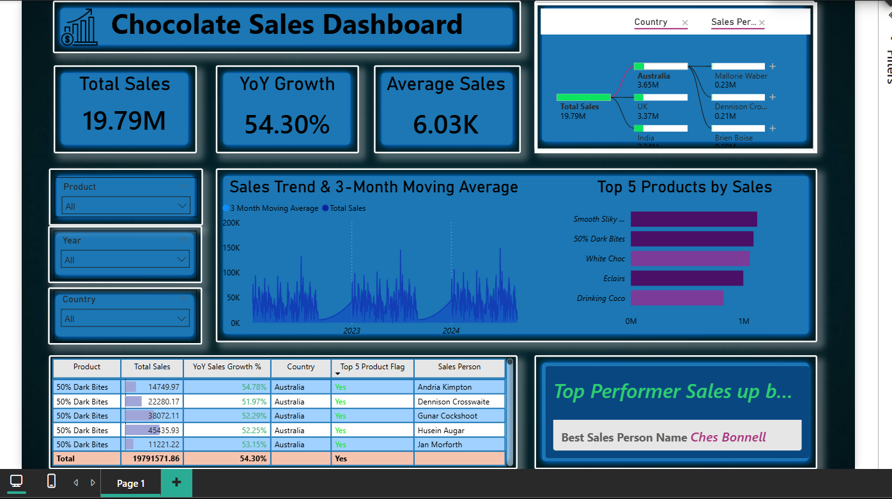

# 🍫 Chocolate Sales Dashboard – Power BI

An interactive **Power BI Dashboard** that analyzes chocolate sales performance and delivers actionable business insights.

This dashboard highlights overall sales growth, product performance, and top sales representatives through dynamic and interactive visualizations.

---

## 🖼️ Dashboard Preview

---

## 🔗 Live Dashboard

👉 **[Click here to view the interactive Power BI Dashboard](https://tinyurl.com/yxr3n9a2)**

---

## 📊 Key Metrics

- **Total Sales:** 19.79M  
- **Year-over-Year Growth:** 54.30%  
- **Average Sales:** 6.03K  

---

## 📈 Key Features

- Sales Trend with 3-Month Moving Average  
- Top 5 Products by Sales  
- Detailed Sales Table with YoY Growth %  
- Top Performer Highlight Section  
- Interactive Filters for:
  - Product  
  - Year  
  - Country  

---

## 🎯 Business Insights

- Identifies best-performing chocolate products  
- Tracks sales growth patterns over time  
- Highlights high-performing sales representatives  
- Enables dynamic filtering for deeper performance analysis  

---

## 🛠 Tools & Skills Used

- Power BI  
- Data Modeling  
- DAX Measures  
- Data Visualization  
- Business Performance Analysis  

---
## 👨‍💻 Author
**Samee Khan**  
Aspiring Data Analyst | Power BI | Python | SQL  

GitHub: https://github.com/samee-khan777 
---

If you found this project useful, feel free to ⭐ the repository.
